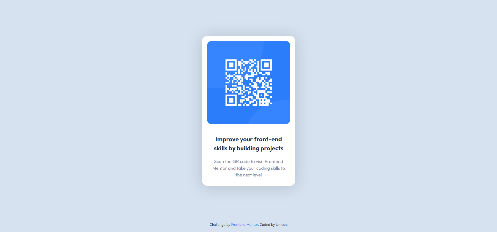

# Frontend Mentor - QR code component solution

This is a solution to the [QR code component challenge on Frontend Mentor](https://www.frontendmentor.io/challenges/qr-code-component-iux_sIO_H). Frontend Mentor challenges help you improve your coding skills by building realistic projects. 

## Table of contents

- [Overview](#overview)
  - [Screenshot](#screenshot)
  - [Links](#links)
- [My process](#my-process)
  - [Built with](#built-with)
  - [What I learned](#what-i-learned)
  - [Useful resources](#useful-resources)
- [Author](#author)


## Overview

### Screenshot



### Links

- Solution URL: [Add solution URL here](https://your-solution-url.com)
- Live Site URL: [Add live site URL here](https://your-live-site-url.com)

## My process

### Built with

- Semantic HTML5 markup
- CSS custom properties
- Flexbox
- [Bootstrap](https://getbootstrap.com/) - Bootstrap framework


### What I learned

I learned about using vh units in CSS.

```css
div.qrcard {
  height: 95vh;
}
```


### Useful resources

- [Vertical Centering](https://blog.logrocket.com/13-ways-vertically-center-html-elements-css/) - This article helped to with centering my elements.


## Author

- Github - [Umesh] (https://github.com/umeshchavda05)
- Frontend Mentor - [@umeshchavda05](https://www.frontendmentor.io/profile/umeshchavda05)
